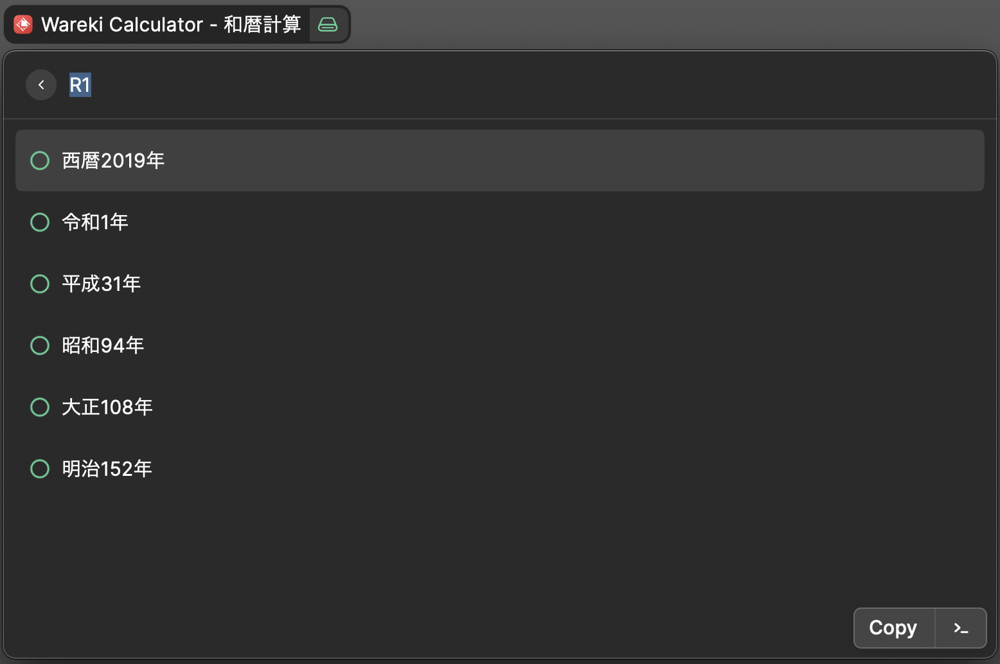

# Raycast Extension: 和暦と西暦の変換

## Overview

- 数値のみの入力は西暦として扱う
- 元号は以下のパターンを扱う、プレフィクスとして以下のパターンがあればその元号で扱う
  - M,明治,明
  - T,大正,大
  - S,昭和,昭
  - H,平成,平
  - R,令和,令

### Examples



```
入力
   2019 or H31 or 平成31 or 平31 or R1 or 令和1 or 令1
出力
   西暦2019年
   令和1年
   平成31年
   昭和94年
   大正108年
   明治152年
```

### Install

clone this repository.

```
npm install
npm run dev
```

And cancel devtools using Ctrl+C, then available Wareki Calculator.
